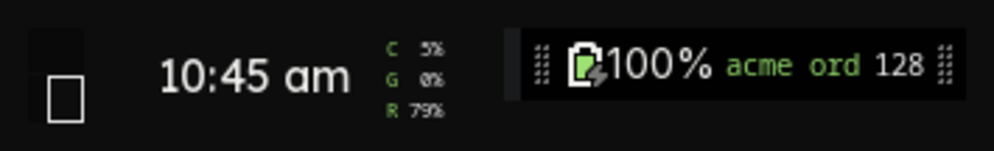

# Shadow — an XFCE theme and two panel widgets

Dark, opaque, discreet. A GTK + xfwm4 theme and a matching terminal palette,
plus two `genmon` panel widgets, for XFCE on Linux.

The theme is **generated from a palette file**, not hand-drawn. Change six
colours in `palette.sh`, run `./build-theme.sh`, and the GTK stylesheet, the
window decorations and the terminal scheme all move together. Re-tinting it for
your own colours is a two-minute job, which is the main reason it is worth
publishing.



## What is in here

| | |
|---|---|
| `palette.sh` | Every colour, once. The only file you edit to re-tint. |
| `build-theme.sh` | Generates `build/Shadow/` — GTK 3 + GTK 4 CSS, xfwm4 decorations, terminal scheme. |
| `install.sh` | Builds, installs to `~/.themes`, and optionally applies it. |
| `widgets/shadow-sysmon` | CPU / GPU / RAM as three stacked percent lines in one compact panel item. |
| `widgets/shadow-kpi` | Rotates values from a JSON file on the panel. Bring your own JSON. |
| `widgets/shadow-kpi-lines` | The same feed as a block of lines, for a conky desktop widget. |

## Install

```sh
git clone https://github.com/shadow-software/shadow-xfce-theme.git
cd shadow-xfce-theme
./install.sh            # build + install to ~/.themes
./install.sh --apply    # …and point XFCE at it
```

Requires `xfconf-query` (XFCE) and ImageMagick (`magick`) to generate the window
decorations. `install.sh --apply` records your current theme first; put it back
with `./install.sh --restore`.

Terminal colours are per-profile and cannot be set from a script:
**Terminal ▸ Preferences ▸ Colors ▸ Presets ▸ Shadow** after installing.

## The widgets

Both are [genmon](https://docs.xfce.org/panel-plugins/xfce4-genmon-plugin)
scripts — add a "Generic Monitor" to your panel and point it at the file.

**`shadow-sysmon`** — three lines, ~2s refresh. On a hybrid-graphics laptop it
reads `runtime_status` from sysfs first and only runs `nvidia-smi` when the
discrete GPU is *already awake*, so putting it on your panel does not keep the
dGPU powered on. Tune with `SHADOW_SYSMON_FONT` (default `5.5`, sized for a
34px panel).

**`shadow-kpi`** — reads a JSON file and rotates one value per refresh:

```json
{
  "generated": "2026-08-22T10:00:00Z",
  "kpis": [ { "metric": "open_bugs", "business": "acme", "value": 3,
              "unit": "issues", "ok": true } ],
  "blocked": []
}
```

Point it at yours with `SHADOW_KPI_FEED`, choose what rotates with
`SHADOW_KPI_ROTATION` (`business:metric` or bare `metric`). It shows how old the
feed is and marks it stale past `SHADOW_KPI_STALE_MIN` minutes — a number
presented as live when it is an hour old is worse than no number.

The widget deliberately does no network access and holds no credentials.
Whatever writes the JSON is where that belongs.

## Opacity, and the seam

`SHADOW_ALPHA` in `palette.sh` sets the window frame's alpha **and** is written
into the terminal scheme as `BackgroundDarkness`. Keep them equal: the title bar
and the app content are two different surfaces, and any difference in opacity
between them shows up as a visible seam. The title strip is deliberately the
same colour as the content below it for the same reason.

Translucency needs a compositor. On XFCE:

```sh
xfconf-query -c xfwm4 -p /general/use_compositing -s true
```

**If you edit the theme in place, restart the window manager.** xfwm4 loads a
theme once and keeps it, so rewriting the files under a name it already has
loaded changes nothing — and it will keep the *old* button hit-regions while
drawing the *new* artwork, which looks like a button that is visible but dead:

```sh
xfwm4 --replace &
```

Buttons are generated at exactly the title-bar height for the same reason: xfwm4
takes each button's clickable box from its image, so a button smaller than the
title bar draws in one place and takes clicks in another.

## Palette

| Role | Colour |
|---|---|
| ground | `#060606` `#0d0d0d` `#151515` `#1e1e1e` `#2a2a2a` |
| ink | `#ededed` `#8b8e84` `#5c5f58` |
| accent | `#8fd468` — used as glow and edge, never as a large fill |
| states | `#e0b657` warn · `#d4756b` error · `#9de073` ok |

## Notes

- GTK theming is thin on purpose: it imports GTK's own dark stylesheet and
  re-tints it through named colours. A full re-implementation would look the
  same and break on the next GTK release.
- xfwm4 needs PNG window decorations, so `build-theme.sh` draws them with
  ImageMagick from the palette rather than shipping binary art you cannot edit.

## License

MIT — see [LICENSE](LICENSE).
